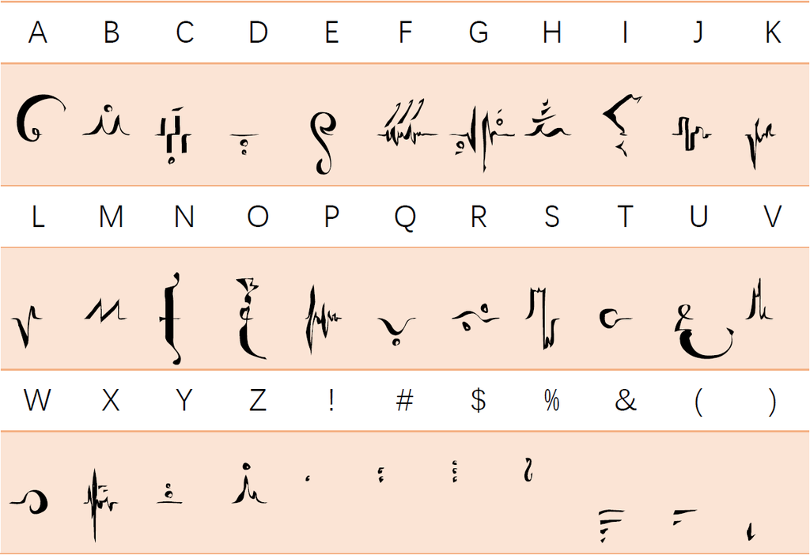

# 主世界：乌汀

## 第一节：世界之树

在多元宇宙的黎明，时间与空间如同虚无中的幻影。然而，正是在这片空灵的寂静中，原初的意识悄然诞生。它以虚无为养分，孕育出现实的种子。

岁月流转，在无数现实的交织下，意识孕育了思想，赋予生命绽放的契机。有情之物得以获得意义，无情之物得以获得形态。伟大的原初至今仍不断延展，开辟虚无，演绎着现实的奇迹。乌汀，意指「接受」和「传承」，不仅是对原初意识的称谓，更是这个世界的名字。

### 第一条：现实

乌汀所创造的现实源自虚无，其最初形态中蕴含着两种相对而又互补的力量：一种向内收缩，象征着固定与静态；另一种向外扩张，代表着灵活与动态。这两股力量在原始的宇宙中交相辉映。当内敛之力占据上风时，现实便凝聚成基质；而当发散之力占据主导时，现实则化为灵质。

混沌中的现实不断分化、重组，最终留下无意义的以太。以太如同一层隔膜，使得基质与灵质无法再度结合。在以太的阻隔下，汇聚灵质的一侧成为了「虚境」；而聚集基质的一侧则被称为「实境」。

### 第二条：元气与原质

元气是伴随乌汀思想而生的实体。如果将乌汀的思想比作乐曲，那么元气便是奏响这曲子的琴弦。

元气的振动能够影响基质与灵质的结合规律，使它们形成稳定存在的复合现实，即“原质”。在元气的振动下，以太也可能被分解，从而孕育出新的原质。

根据原质形成的特性，元气的频谱可分为四个波段，而形成以太的波段则统称为「浊气」。

- **磁气**：携带较高动能，在其影响下会形成由基质主导的赤原质。此类原质具有持续放射和变化特点，具体表现为冷热、明暗、电磁等现象。
- **辰气**：携带较低动能，在其影响下会形成由基质主导的黄原质。此类原质具有持续停滞特点，具体表现为飞禽走兽、草木土石、清泉流水等事物。
- **阳气**：携带较高动能，在其影响下会形成由灵质主导的白原质。此类原质具有持续放射和变化特点，具体表现为情绪、思想、欲念等现象。
- **阴气**：携带较低动能，在其影响下会形成由灵质主导的黑原质。此类原质具有持续停滞特点，具体表现为意识、记忆、人格等事物。
- **浊气**：无法测量动能，在其影响下会形成青原质，即以太。

## 第二节：存在位面

以太的存在不仅将虚境与实境区分开来，还将这两者划分为多个被称为「位面」的独特区块。这些位面不仅是另一个世界的简单延伸，更是元气频率差异所形成的多维空间。

- **物质位面**：源自实境，这些位面中充满了具体的物质实体、自然景观以及成千上万的生灵，因而也被称为「尘世」。
- **精神位面**：诞生于虚境，这些位面是信息与思想的汇聚之地，亦称之为「灵界」。
- **映像位面**：位于虚境与实境的夹缝之中，这些位面承载着经过精神位面过滤而来的物质投影，被称为「影界」。

### 第一条：灵与肉

质量这一概念仅存在于基质之上，因此，由灵质主导的虚境并不具备质量。在虚境中，信息交互的速度极快，以至于在其眼中，实境中的一切仿佛都处于静止状态。

虚境中的现实始终处于激烈的变动之中，难以长时间存储有序的信息。然而，随着生物的不断演化，它们逐渐掌握了在实境中存储信息，同时在虚境中处理信息的能力。是否具备沟通虚境与实境的器官——灵髓，成为区分生物与非生物的唯一标准。

信息在虚境与实境之间往返的时间，即是生物思维的速度。同时，一次性能够传输的信息越多，生物便能做出更复杂的反应。灵髓的性能便是决定这两点的关键，而强大的灵髓也是建立自我意识的前提。

### 第二条：意识与思想

与乌汀的意识不同，生物意识是一种在信息处理能力超越一定阈值后所产生的感受。

低等意识，即本能，广泛存在于自然界中的生命体。而拥有高等意识的生物则能够觉察自身需求，无论是最低层次的生理需求，还是更高层次的道德需求，并据此进行学习、提升、纠错、反省和总结，从而朝向特定目标迈进。

以高等意识为基础，源源不断的信息使得有序的虚境结构——思想——得以诞生。生物的思想与乌汀的思想有所不同，是一种独立于感受而发生的认知过程，其最典型形式为判断和推理。

然而，高等意识所输出的大量信息，更容易与虚境中的混乱信息发生纠缠，从而导致处理结果出现误差。这些「噪音」可能使输出的信息远超输入的信息。

由于虚境中的既存信息均沾染着乌汀的痕迹，过多的纠缠将导致生物思想与乌汀产生接触。这种接触将对灵髓造成极大的负担，同时也会赋予生物超越感官极限的感知能力。然而，接触者最终往往会被海量信息淹没，导致精神失常，或是灵髓受损。

### 第三条：真理

若有幸在与乌汀接触中保持理智并存活下来，这次接触将会在生物思想中留下某种声音，其中蕴含着世间万物形成原理，是秩序的极致体现，象征着「真理」本身。

真理的本质是元气振动所形成的波形。由于元气频率可轻易达到600,000Hz，理解其中含义并准确发出对应频率声音变得异常困难。

只要能够做到这一点，便意味着掌握了言出法随、律令万物，那名为魔法的力量。为了克服这一难题，幸存者们用文字记录他们所获知的声音频段。这些文字便是如今施展魔法不可或缺的符文。

然而，在真理强大力量的表面之下，潜藏着无法避免的诅咒。随着施法者对真理掌握程度愈加深入，其表达出的真理愈加接近现实，与乌汀之间的联系也日益紧密。疯狂随之而来，成为每个施法者无法逃避的宿命。

- **月咏**：传说中，人类贤者从月亮的阴晴圆缺中获得启示，创造了名为月咏的符文，其中包含26个字母。这些符文仅记录了20Hz至20,000Hz范围内的信息，而非真理完整含义。因此，月咏符文还包含7个音标，用以表示那些无法听到的频率范围内的声音条件。
  
- **诗音**：随着月咏符文的普及，施法者发现若将情绪与符文融合，通过思念波动模仿真理的韵律，可以显著降低阐述和理解真理的难度。这些融合情绪而成的符文便是诗音符文。

  相较于原始月咏符文，诗音符文提供了更全面、简洁的书写系统。根据使用种族、地区、年代等条件差异，诗音符文存在不同音律差异。音律不同之符文间可能存在冲突，因此不能同时使用。

#### 表：月咏符文

#### 表：诗音符文

### 第四条：认知世界

环境信息通过生物感官输入灵髓，并最终在虚境中处理成能够被思想理解的形态。灵髓只能存在于实境，而思想则只能存在于虚境。这两点限制了生物无论如何都无法单独认知实境或虚境，在此过程中必然遭遇沉余信息带来的干扰。

